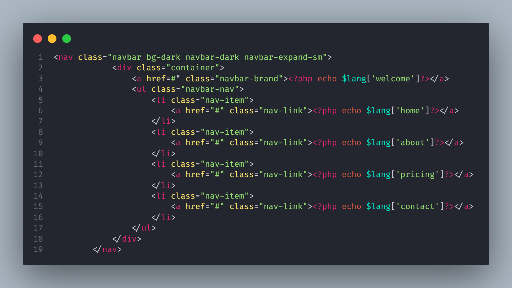

# Using multiple languages on the website.

## Multi-language feature with php easily and quickly

## Usage

- Create a lang file for the languages you will use on your website (each language is a separate file).
- <?php $lang = array ("variable" => "Equivalent in the language you made", ... ); ?> (Do not put a comma at the end of the last word you translated.)
- Find the word you translated on your site, remove the word and write <?php echo $lang['variable']?>.
- Ready to use


    ```md
    
    ```
